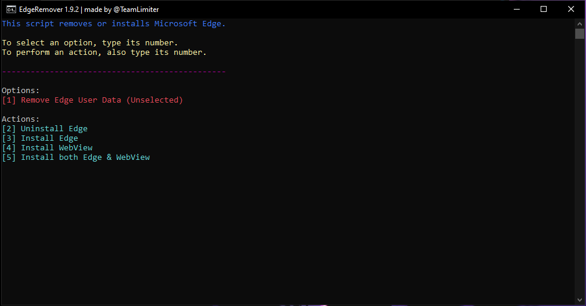

<p align="center">
  
</p>

<p align="center"><b>A PowerShell script that aims to non-forcefully uninstall or reinstall Microsoft Edge on Windows 10 & 11.</b></p>

---

### ⬇️ Usage
You can use the command below in PowerShell to launch the script. Alternatively, get the latest script from the [GitHub releases](https://github.com/TeamLimiter/EdgeRemover/releases/latest).

```powershell
iex(irm https://cdn.jsdelivr.net/gh/TeamLimiter/EdgeRemover@main/get.ps1)
```

<p align="center">
  
</p>

#### 📜 Implementation in Scripts

Download the script and run `Get-Help .\RemoveEdge.ps1` to see its options. You can either use the downloaded file directly with these arguments or put them into the snippet below:

```powershell
iex "&{$(irm https://cdn.jsdelivr.net/gh/TeamLimiter/EdgeRemover@main/get.ps1)} [ARGUMENTS HERE]"
```

<details>
  <summary>Example</summary>

  This would uninstall Edge, remove Edge's user-data, and install Edge WebView:
  ```powershell
  iex "&{$(irm https://cdn.jsdelivr.net/gh/TeamLimiter/EdgeRemover@main/get.ps1)} -UninstallEdge -RemoveEdgeData -InstallWebView"
  ```
</details>

### 🫧 Clearing Edge Blocks
You can use the command below in PowerShell to clear all EdgeUpdate policies, including those that block the reinstallation and update of Edge or WebView.

```powershell
iex "&{$(irm https://cdn.jsdelivr.net/gh/TeamLimiter/EdgeRemover@main/get.ps1)} -ClearUpdateBlocks"
```

### ✅ Additional Credits

- [ Aʀ!ɢᴀᴛᴏ ](https://teamlimiterx.blogspot.com/) - minor bug fixes
- [ART LUCKY FF](https://www.youtube.com/@ArT_LUCKY_FF) - inspired this script
